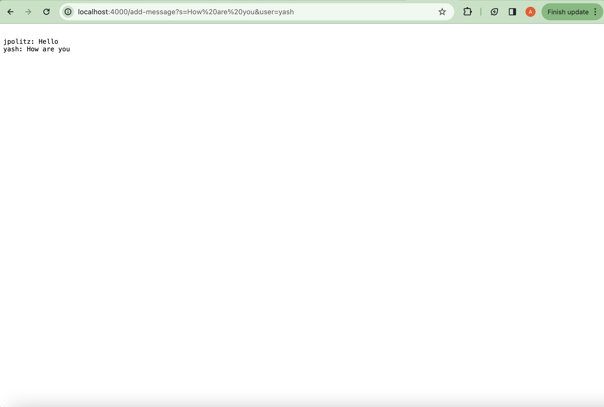
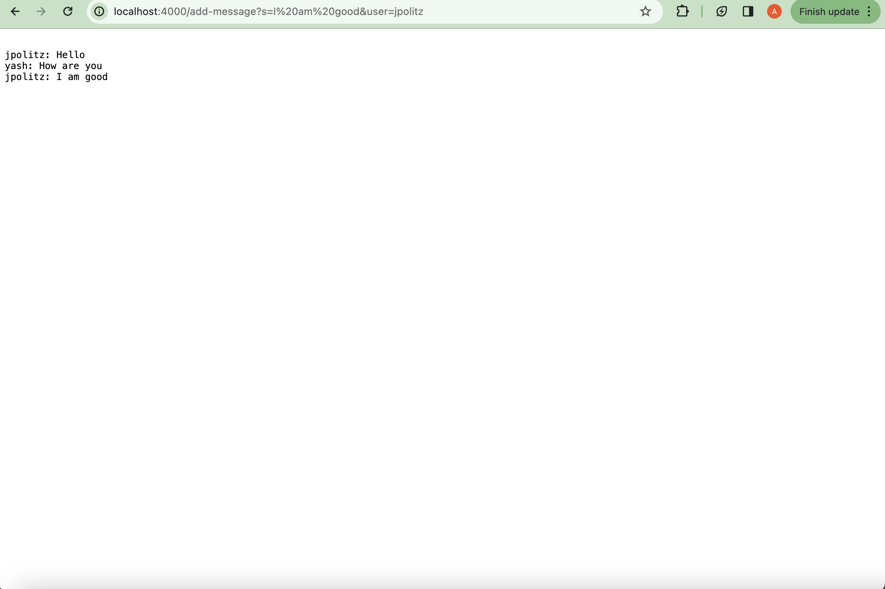
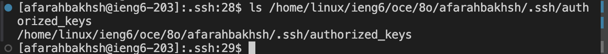
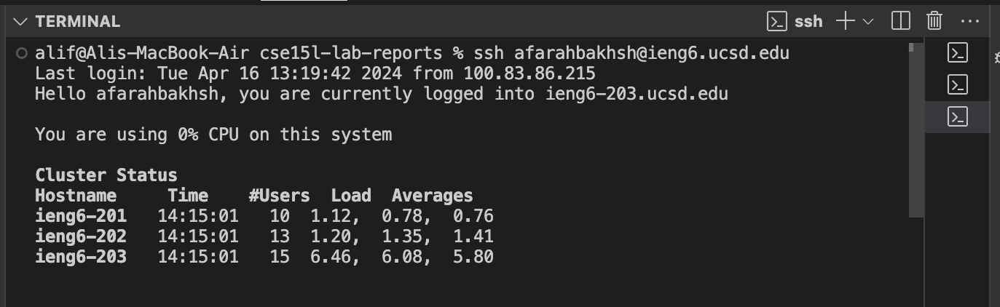

# Lab Report 2

```
import java.io.IOException;
import java.net.URI;
import java.util.ArrayList;
class StringHandler implements URLHandler {
    ArrayList<String> messages = new ArrayList<String>();
    public String handleRequest(URI url) {
        if (url.getPath().contains("/add-message")) {
            String[] parameters = url.getQuery().split("&");
            String messageGiven = parameters[0].split("=")[1];
            String userName = parameters[1].split("=")[1];
            String returnString = "";
            messages.add(userName+": "+messageGiven);
            for (String message:messages){
                returnString = returnString +"\n"+message;
            }
    return returnString;
        } else {
            return "404 Not Found!";
        }
    }
}

class StringServer {
    public static void main(String[] args) throws IOException {
        if(args.length == 0){
            System.out.println("Missing port number! Try any number between 1024 to 49151");
            return;
        }

        int port = Integer.parseInt(args[0]);

        Server.start(port, new StringHandler());
    }
}

```



* This request called the .add list method to add the new message to the array list.
* The class's list gets a new string added with the value: `yash: How are you`
* The messageGiven and userName variables change from this request



* This request called the .add list method to add the new string to the array list.
* The class's list gets a new string added with the value: `jpolitz: I am good`
* The messageGiven and userName variables changed in this request to reflect that of the new user. The parameter variable also changes as new parameters are sent

## Part 2:

1. `ls` locally

2. `ls` on ien6

2. `ssh` login without password


## Part 3:
I didn't know how to save my ssh information so I don't have to continously input my password. From the lab today, I learned how to store my information so I don't have to input my password everytime I ssh.