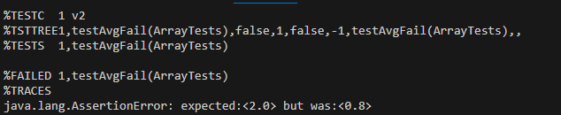
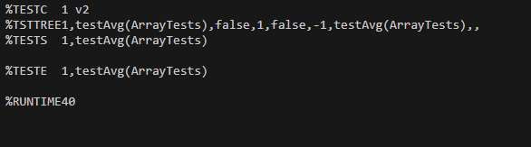

# Lab Report 3
I will be using the averageWithoutLowest method from ArrayExamples
## Part 1
1. A failure-inducing input:
```
  @Test 
  public void testAvgFail(){
    double[] input1 = {1,1,1,1,2,2};
    double avg = 2;
    assertEquals(avg,ArrayExamples.averageWithoutLowest(input1),0);
  }
```
2. A input that doesn't fail:
```
  @Test 
  public void testAvg(){
    double[] input1 = {1,2,3,4,5 };
    double avg = 3.5;
    assertEquals(avg,ArrayExamples.averageWithoutLowest(input1),0);
  }
```
3. 
Failing Test: 



Passing Test: 



4.
Before fixing:
```
  static double averageWithoutLowest(double[] arr) {
    if(arr.length < 2) { return 0.0; }
    double lowest = arr[0];
    for(double num: arr) {
      if(num < lowest) { lowest = num; }
    }
    double sum = 0;
    for(double num: arr) {
      if(num != lowest) { sum += num; }
    }
    return sum / (arr.length - 1);
  }
```
After fixing:
```
  static double averageWithoutLowest(double[] arr) {
    if(arr.length < 2) { return 0.0; }
    double lowest = arr[0];
    int totalCount =0;
    for(double num: arr) {
      if(num < lowest) { lowest = num; }
    }
    double sum = 0;
    for(double num: arr) {
      if(num != lowest) { 
        sum += num;
        totalCount+=1;
      }
    }
    return sum / totalCount;
  }

```
5. This fix addresses the issue because the previous code didn't account for when there was more than one occurance of the lowest number.
To fix this, instead of diving the `sum` by the length of the array-1, I added a new variable called totalCount and divided sum by `totalCount`. `totalCount` represents the total number of times numbers not equal to the lowest come up.

## Part 2
I will reserach the command `find`. I found this website, and this is the source for all of the information below: https://www.geeksforgeeks.org/find-command-in-linux-with-examples/

4 options:

1. -type 

Specify a file type to serach for, can write characters like f for regular files or d for directories.

Examples:
```
$ find . -type d
.
./911report
./biomed
./government
./government/About_LSC       
./government/Alcohol_Problems
./government/Env_Prot_Agen
./government/Gen_Account_Office
./government/Media
./government/Post_Rate_Comm
./plos
```
This command is finding all directories in the `./technical` path. This is useful because it allows us to see all direcotires in a clear manner with one command and get the relative path to accessing them.
```
$ find ./911report -type f
./911report/chapter-1.txt
./911report/chapter-10.txt
./911report/chapter-11.txt
./911report/chapter-12.txt
./911report/chapter-13.1.txt
./911report/chapter-13.2.txt
./911report/chapter-13.3.txt
./911report/chapter-13.4.txt
./911report/chapter-13.5.txt
./911report/chapter-2.txt
./911report/chapter-3.txt
./911report/chapter-5.txt
./911report/chapter-6.txt
./911report/chapter-7.txt
./911report/chapter-8.txt
./911report/chapter-9.txt
./911report/preface.txt
```
This command is finding all files in the `./technical/911report` path. This is useful because it lets the user see all files that exist in a specific directory and all of its subdirectories and gives a relative path to each file.

2. -mtime

Takes in a variable n which represents number of days since file was last modified and uses it to reutnr files based on modification time.
```
$ find ./911report  -mtime -1
./911report
./911report/chapter-1.txt
./911report/chapter-10.txt
./911report/chapter-11.txt
./911report/chapter-12.txt
./911report/chapter-13.1.txt
./911report/chapter-13.2.txt
./911report/chapter-13.3.txt
./911report/chapter-13.4.txt
./911report/chapter-13.5.txt
./911report/chapter-2.txt
./911report/chapter-3.txt
./911report/chapter-5.txt
./911report/chapter-6.txt
./911report/chapter-7.txt
./911report/chapter-8.txt
./911report/chapter-9.txt
./911report/preface.txt
```
This command allows us to find things in the `./technical/911report` directory that have been modified within the past day. It's useful if users want to find the file that they have most recently been working on as they can simply filter by last modified 

```
$ find ./911report  -mtime -7
./911report
./911report/chapter-1.txt
./911report/chapter-10.txt
./911report/chapter-11.txt
./911report/chapter-12.txt
./911report/chapter-13.1.txt
./911report/chapter-13.2.txt
./911report/chapter-13.3.txt
./911report/chapter-13.4.txt
./911report/chapter-13.5.txt
./911report/chapter-2.txt
./911report/chapter-3.txt
./911report/chapter-5.txt
./911report/chapter-6.txt
./911report/chapter-7.txt
./911report/chapter-8.txt
./911report/chapter-9.txt
./911report/preface.txt
```
This command allows us to find things in the `./technical/911report` directory that have been modified within the past 7 days. It's useful if users want to find the file that they have worked on over the last 7 days as they can simply filter by last modified  rather than looking through all files in the directory.


3. -empty

Finds all empty files and directories.
```
$ find . -empty
./911report/chapter-9.txt
```
For this example I deleted all text in the `chapter-9.txt` file and the command returned the relative path to it as the `.txt` file was empty. This is useful as it can make it easy to find empty files rahter than having to manually go through all of them or writing a script that checks whether `.txt` files are empty.
```
$ find . -empty
./test
```
For this example I made a new empty directory called `test` and left it empty to see how the command deals with directories, as you can see, the command returned the path to the directory as it has no files in it. This is useful as we cna use it to find and delete unwated/empty directories or for any other reason that we may want to find an empty directory.


4. -maxdepth 

Restricts serach to a maximum directory depth.

```
$ find . -maxdepth 1
.
./911report
./biomed
./government
./plos
```
This command found all items in the `./technical` directory and it didn't go into any subdirectories because `maxdepth 1` limited the depth of the serach only to the current directory. This is useful because in cases where ther are tons of files (like in this one) we may want to find all files in a certain directory only but `find .` will return so many files that it will be hard to distinguish which is which, therefore we may want to limit the depth.
```
find government -maxdepth 1
government
government/About_LSC
government/Alcohol_Problems
government/Env_Prot_Agen
government/Gen_Account_Office
government/Media
government/Post_Rate_Comm
```
This command returned all elements that were in the `./technical/government` path and did not go into any of hte subdirectories as `maxdepth` was set to `1`. This was useful because without `maxdepth -1` so many paths would have been printed to the terminal that I can't even get to the top, so if I only want to know what's specifically in `./technical/government` and not subdirectories, it would have been very difficult.


