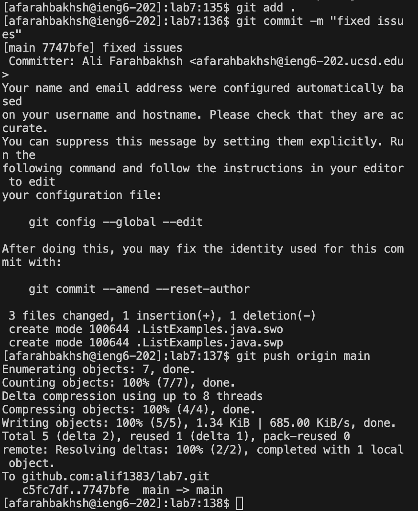

# Lab Report 4

### Step 4:

Keys pressed: ssh ``<space>`` afarahbakhsh@ieng6.ucsd.edu `<enter>`

Pressed the keys above to get into ieng6. This command allowed me to bassicaly login to ieng6 using my email, since I had already set it up, I didn't need to do more authorization.

### Step 5:

Keys pressed: git ``<space>`` clone ``<space>`` git@github.com:alif1383/lab7.git `<enter>`

Before cloning the repo, I had to go to Github.com and fork the repository, but that did not take any key press as I just used the mouse. After, I used the command above to tell git to clone my lab7 repository.

### Step 6:

Keys pressed:

 cd `<space>` lab7 `<enter>`
 javac `<space>` -cp `<space>` .:lib/hamcrest-core-1.3.jar:lib/junit-4.13.2.jar *.java `<enter>`

java `<space>` -cp `<space>` .:lib/hamcrest-core-1.3.jar:lib/junit-4.13.2.jar org.junit.runner.JUnitCore `<space>` ListExamplesTests `<enter>`

The commands above allowed me to enter the lab7 folder, combile the java files, and run ListExamplesTests.java using Junit for testing.

### Step 7:

Keys pressed:
vim `<space>` ListExamplesTests.java `<enter>` 
Then scrolled down and clicked on index1 that needs to be edited, clicking in the space after it, between “index1” and “=“. 
Finally, pressed:

ESC, backspace, 2, ESC :wq

The commands above allowed me to open ListExamplesTests.java in vim, then I simply scrolled down to where the issue was and clicked on it, then pressed ESC to enter editing mode and the next two keys did the edit. After the edit was done, I pressed ESC again to exit that mode and pressed :wq to save my changes and close the file.

### Step 8:

Keys pressed:
`<up><up><up><enter>`,`<up><up><up><enter>`

I had to press up four times back to back to do the following commands from history:

1. javac -cp .:lib/hamcrest-core-1.3.jar:lib/junit-4.13.2.jar *.java 

2. java -cp .:lib/hamcrest-core-1.3.jar:lib/junit-4.13.2.jar org.junit.runner.JUnitCore ListExamplesTests 

Each `<up>` press allows me to go one command higher in the history of commands I put in the console, so I simply went up until I reached the commands needed and used commend #1 to compile Java files and #2 to run the ListExamplesTests using Junit.

### Step 9:

Keys pressed:
git `<space>` add `<space>` . `<enter>`

git `<space>` commit `<space>` -m `<space>` “fixed `<space>` issue” `<enter>`

git `<space>` push `<space>` origin `<space>` main `<enter>`

THe first two commands saved and commited my changes to the local repo, and the last command pushed my changes to the remote repo.