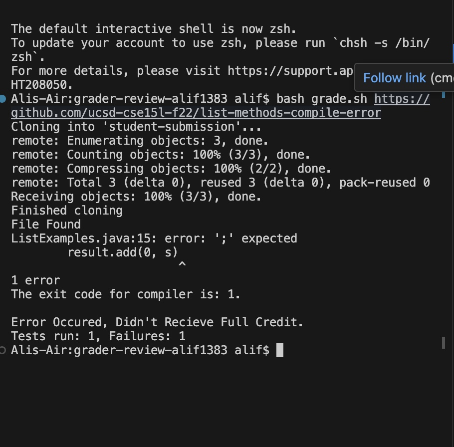
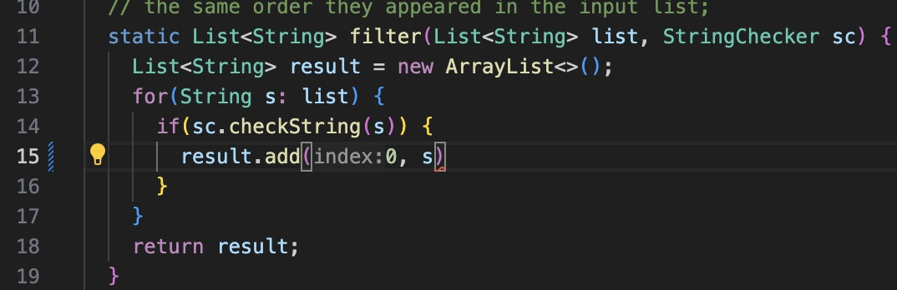
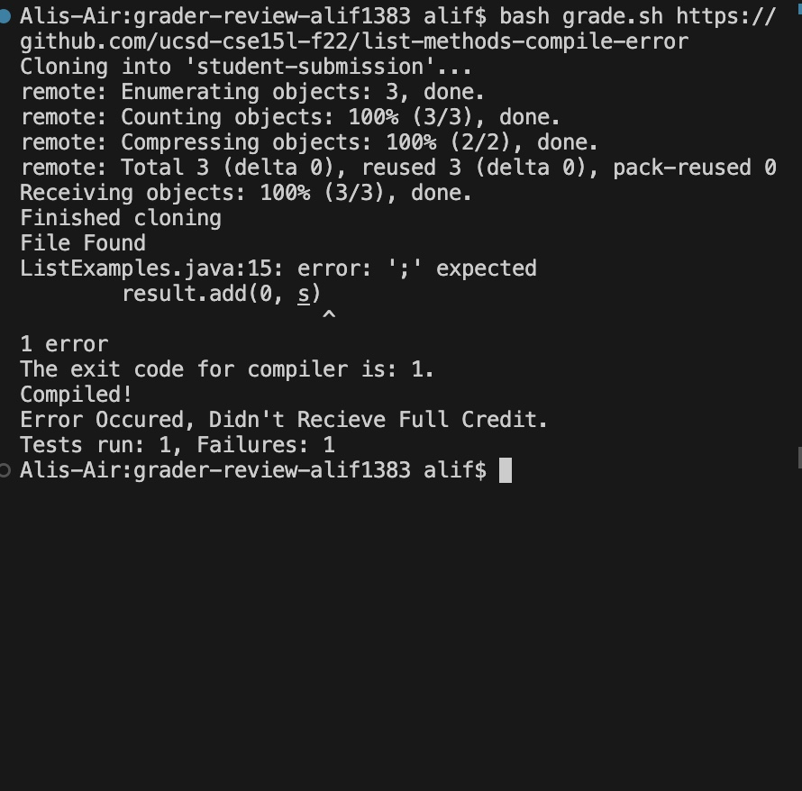

# Lab Report 5

## Student:

Hi! I was working on the grading script and ran into a bug that I can't figure out. For some reason, even when the JAVA files don't compile, the grading script proceeds to run JUNIT tets instead of just exiting the script. This is not desirable as time is wasted running tests that will 100% fail as the code doesn't even compile! 

The command I ran with the symptom can be seen below:



I think the issue comes form this part of my grade script, where I try to check if compilation is succesful.


```
#Step 4:
cd grading-area
javac -cp $CPATH *.java

echo "The exit code for compiler is: $?."
if [[ $? == 0 ]]
then
    echo ""
else
    exit
fi
```
It seems like if the student submission doesn't compile, the code doesn't stop the script for some reason even though it says exit. Please help! Thanks!

As you can see below, the JAVA file shouldn't compile since a `;` is missing.



## TA:

Hello

In your if statement, make sure that it actually enters the else part when the compiler's code isn't zero and doesn't just echo "" all the time. 

## Student:



Thanks for the suggestion! I changed that part of the grading script to:

```
#Step 4:
cd grading-area
javac -cp $CPATH *.java

echo "The exit code for compiler is: $?."
if [[ $? == 0 ]]
then
    echo "Compiled!"
else
    echo "Test Failed!"
    exit
fi
```

Now, it's clear what the bug is. The issue is that even when the compiler's exit code isn't zero in the if statement, the script doesn't go to the else statement and seems to always print `Compiled!` regardless of whether the code actually compiled or not.

----

The file and directory structure needed to test this can be found in this git repo: https://github.com/alif1383/grader-review-alif1383 

The directory structure that's needed is having two `.jar` files at `./lib` and `grade.sh` along with `TestListExamples.java` at `./`. If these files are present, the script will do everything else on its own.

To run the `grade.sh` script and see the same results, simply run `bash grade.sh https://github.com/ucsd-cse15l-f22/list-methods-compile-error` in the terminal to run the script.

The content of each file before fixing the bug can be seen here:

## TestListExamples.java:

```
import static org.junit.Assert.*;
import org.junit.*;
import java.util.Arrays;
import java.util.List;

class IsMoon implements StringChecker {
  public boolean checkString(String s) {
    return s.equalsIgnoreCase("moon");
  }
}

public class TestListExamples {
  @Test(timeout = 500)
  public void testMergeRightEnd() {
    List<String> left = Arrays.asList("a", "b", "c");
    List<String> right = Arrays.asList("a", "d");
    List<String> merged = ListExamples.merge(left, right);
    List<String> expected = Arrays.asList("a", "a", "b", "c", "d");
    assertEquals(expected, merged);
  }
  @Test(timeout = 500)
  public void testMergeLeftEnd() {
    List<String> left = Arrays.asList("a", "b", "c");
    List<String> right = Arrays.asList("a", "d");
    List<String> merged = ListExamples.merge(right,left);
    List<String> expected = Arrays.asList("a", "a", "b", "c", "d");
    assertEquals(expected, merged);
  }
  @Test(timeout = 500)
  public void testFilter() {
    List<String> left = Arrays.asList("a", "b", "c","a");
    StringChecker sc = (String s) -> s.equals("a");
    List<String> merged = ListExamples.filter(left, sc);
    List<String> expected = Arrays.asList( "a","a");
    assertEquals(expected, merged);
  }


}
```

## grade.sh:

```
CPATH='.:lib/hamcrest-core-1.3.jar:lib/junit-4.13.2.jar'

rm -rf student-submission
rm -rf grading-area

mkdir grading-area

git clone $1 student-submission
echo 'Finished cloning'


# Draw a picture/take notes on the directory structure that's set up after
# getting to this point

# Then, add here code to compile and run, and do any post-processing of the
# tests

#Step 2:
if [[ -f student-submission/ListExamples.java ]]
then
    echo "File Found"
else
    echo "ListExamples.java not found"
    echo "Grade: 0"
    exit
fi

#Step 3:
cp TestListExamples.java student-submission/ListExamples.java grading-area
cp -r lib grading-area

#Step 4:
cd grading-area
javac -cp $CPATH *.java

echo "The exit code for compiler is: $?."
if [[ $? == 0 ]]
then
    echo ""
else
    exit
fi

#Step 5:
java -cp ".:lib/*" org.junit.runner.JUnitCore TestListExamples > output.txt

if [[ $? == 0 ]]
then 
echo "Recieved Full Credit. 3/3 Points"
else
echo "Error Occured, Didn't Recieve Full Credit."
returnVal=$( tail -n 2 output.txt )
echo $returnVal
fi
```

In order to fix the bug, simply use this grade.sh file:

```
CPATH='.:lib/hamcrest-core-1.3.jar:lib/junit-4.13.2.jar'

rm -rf student-submission
rm -rf grading-area

mkdir grading-area

git clone $1 student-submission
echo 'Finished cloning'


# Draw a picture/take notes on the directory structure that's set up after
# getting to this point

# Then, add here code to compile and run, and do any post-processing of the
# tests

#Step 2:
if [[ -f student-submission/ListExamples.java ]]
then
    echo "File Found"
else
    echo "ListExamples.java not found"
    echo "Grade: 0"
    exit
fi

#Step 3:
cp TestListExamples.java student-submission/ListExamples.java grading-area
cp -r lib grading-area

#Step 4:
cd grading-area
javac -cp $CPATH *.java

if [[ $? == 0 ]]
then
    echo "Compiled! The exist code for Compiler is: $?."
else
    echo "Didn't Compile! Exit code $?"
    exit
fi

#Step 5:
java -cp ".:lib/*" org.junit.runner.JUnitCore TestListExamples > output.txt

if [[ $? == 0 ]]
then 
echo "Recieved Full Credit. 3/3 Points"
else
echo "Error Occured, Didn't Recieve Full Credit."
returnVal=$( tail -n 2 output.txt )
echo $returnVal
fi
```

The bug was caused by the fact that I was doing `echo "The exit code for compiler is: $?."` and then right after this using an if statemnet: `if [[ $? == 0 ]]`. Since the if statement came after the echo, using `$?` no longer gave me the compiler's exit code, therefore I had to move the echos into the if statement, so first check the compiler's exit code then echo anything that is needed.

## Part 2: Reflection

In the second half of the quarter, it was pretty cool to learn how to use bash scripts. I had never written any bash scripts before, so it was cool to learn how tasks can be automated on the computer through bash scripts. Also, generally leraning terminal commands was cool as I didn't know anything about VIM and JDB.

